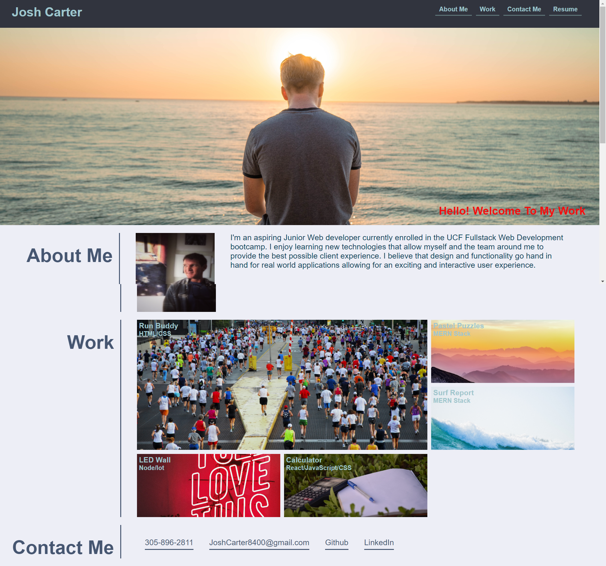

# Josh Carter's Profile Page
The intent of this project was to build a personal Profile webpage to showcase my work as an aspiring fullstack web developer. It has links to my LinkedIn page and to the Github reposoitory pages for each project and also how to contact me personally. 

## Languages and skills Used
1. HTML5
2. CSS3
3. CSS Flexbox
4. CSS Grid 
5. CSS Animations
6. Media Queries to allow for viewing on mobile devices

### Profile webpage can be deployed here: https://joshcarter8400.github.io/Profile/

